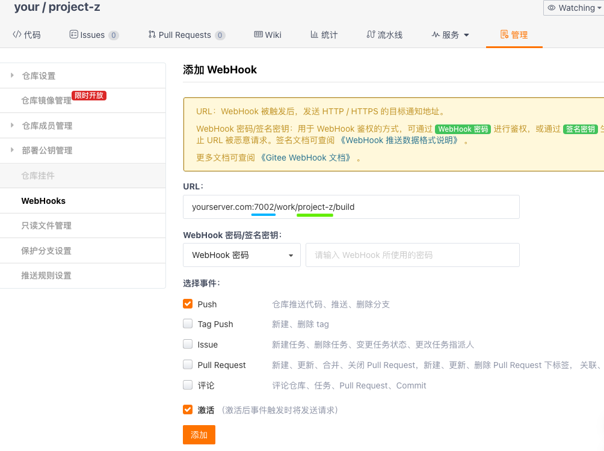
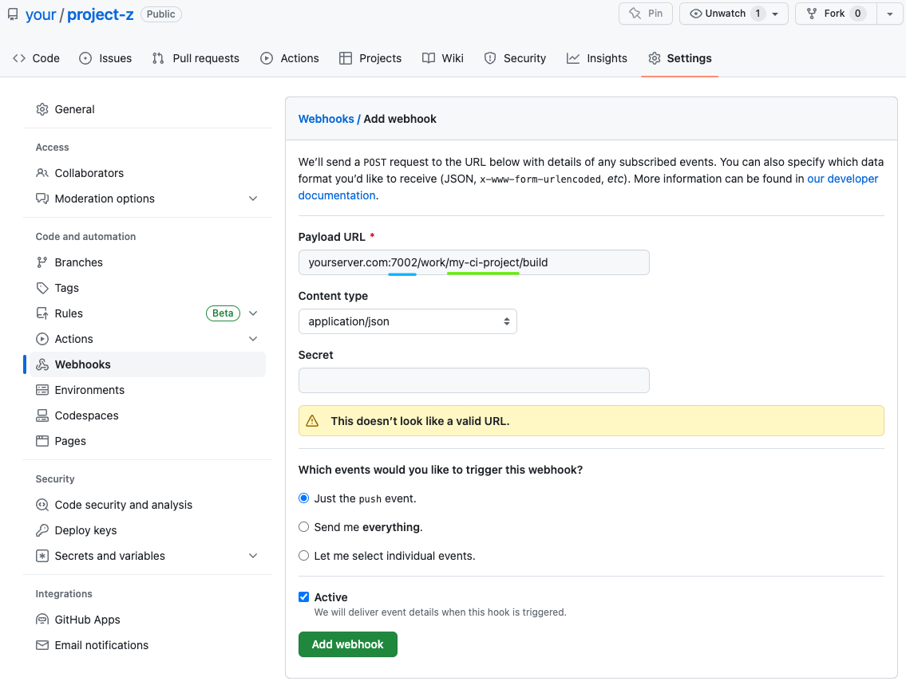

# my-ci 极简的代码部署工具
**Ultra-simplified code deployment tool**


几行配置代码，搞定Git分支自动更新，自动执行脚本，自动部署启动。支持Github，Gitee。Automate updating of Git branches, execution of scripts and deployment with just a few lines of configuration code. Supports Github and Gitee.

## 安装 Install
```shell
# 在部署服务器上安装 Installation on the server
npm i -g my-ci
```

## 使用 Usage

**1、在你的本地项目中创建.my-ci.yml配置文件，并提交git**

**1. Create a .my-ci.yml configuration file in your local project and commit it to Git.**


```yaml
project: project-z
dev-1:
  script:
    - echo "Hello"
    - npm install
  only:
    - /^test_.*/ 
```
**2、在服务器上安装并启动my-ci**

**2. Install and start My-CI on the server.**
```shell
npm i -g my-ci
myci start
# running on port 7002
```
**3、在服务器上clone你的项目并初始化my-ci的工作空间**

**3.Clone your project on the server and initialize My-CI's workspace.**
```shell
git clone github.com/your/project-z
cd project-z
myci watch
```
**4、配置WebHook**

**4. Add WebHook**

在github或gitee等支持WebHook的Git工具上配置推送链接，URL格式如下：

Configure the push URL link on Git tools that support WebHook, such as GitHub or Gitee. The URL format is as follows:
```
${your_server_host}:${my_ci_port}/work/${project_name}/build
www.yourserver.com:7002/work/project-z/build
```
gitee:

github:


**5、成功应用**

**5.Successfully applied**

根据上面配置，本地项目的test_开头分支修改并push后，WebHook触发，服务器上的my-ci服务监听到并自动将project-z切换到test_*分支并执行my-ci.yml中配置好的部署脚本。

According to the configuration above, when the test_* branch of the local project is modified and pushed, the WebHook will be triggered. The my-ci service on the server will automatically switch project-z to the test_* branch and execute the deployment script configured in my-ci.yml.